Skip to content

    MuaazHbobati
    Society

Repository navigation

    Code
    Issues
    Pull requests
    Actions
    Projects
    Wiki
    Security
    Insights
    Settings

Commit b52c70f
MuaazHbobati
MuaazHbobati
committed
1 hour ago
Update README with logo, full screenshots and architecture
main

1 parent
54f1e7a
commit
b52c70f

File tree

    README.md

1 file changed
+129
-78
lines changed

Customizable line height

The default line height has been increased for improved accessibility. You can choose to enable a more compact line height from the view settings menu.
‎README.md‎
+129-78Lines changed: 129 additions & 78 deletions

Original file line number Diff line number Diff line change
@@ -1,127 +1,178 @@

# Society

> Building structure where there is none.

<p align="center">
  
</p>
---

## Why I’m Building Society

## 📖 The Problem

If you study at a Syrian university, you already know what the digital “student community” looks like.
If you study at a Syrian university, you already know what the “digital student community” looks like.

It’s chaos.

Every semester starts the same way.
You’re added to:
Every semester starts the same:

- A WhatsApp group for the class
- Another version without the professor
- Another version without the “serious” students
- Another version “just for announcements”
- Another one for memes
- A Telegram channel
- A backup Telegram channel
- A Facebook group
- A WhatsApp group for the course
- Another version without the professor
- Another version without the “serious” students
- Another one “just for announcements”
- Another one for memes
- A Telegram channel
- A backup Telegram channel
- A Facebook group

All for the same course.
All for **one** subject.

Thousands of messages.  
Most of them useless.
Arguments.  
Spam.  
Forwarded jokes.  
Repeated questions.  
People asking the same thing ten times.
Arguments. Spam. Forwarded jokes.  
Important information gets buried under nonsense.  
Serious students drown in noise.

No structure.  
No filtering.  
No real organization.
And when project time comes, the chaos **multiplies**.

Important information gets buried under nonsense.  
Serious students get drowned in noise.  
And somehow, this is considered “normal.”

---

This isn’t a digital academic environment.  
It’s fragmentation.

## 💡 The Solution

And when project time comes, the same chaos multiplies.
**Society** is a digital academic community built specifically for IT engineering students at SVU.  
It replaces fragmented social media groups with:

That’s where Society begins.

- **Digital Identity** – professional profiles showcasing skills, portfolio, and academic background.
- **Smart Team Formation** – post project requests, get matched with compatible students.
- **Organized Discussions** – tech-focused, no noise, no spam.

---

## What Society Is

## ✨ Key Features

Society is not just a “find project partners” tool.

- ✅ **Fully responsive** – works seamlessly on desktop, tablet, and mobile.
- ✅ **JWT Authentication** – secure login and registration.
- ✅ **Team Formation System** – browse, filter, and view team details.
- ✅ **Clean Architecture** – Domain, Application, Infrastructure, Presentation layers.
- ✅ **Profile Management** – edit personal info, skills, and portfolio links.
- ✅ **Modern UI** – clean, intuitive interface with a blue color theme.

## It’s an attempt to rebuild the academic digital environment properly.

A structured academic community platform.

## 🛠️ Tech Stack

One place.  
Clear systems.  
Defined rules.  
Multiple internal modules solving different problems — not just one.
| Layer | Technologies |
| ------------ | ----------------------------------------------------------------------------------- |
| **Backend** | ASP.NET Core 8 Web API, Clean Architecture, Entity Framework Core (Code First), JWT |
| **Frontend** | React.js, JavaScript (ES6+), HTML5, CSS3, Responsive Design |
| **Database** | SQL Server |

### Core Systems

---

## 🧱 Architecture

Society follows **Clean Architecture** with clear separation of concerns:

- Structured team formation
- Organized academic discussions
- Student profiles with real academic context
- Controlled posts and meaningful interaction
- Noise-reduction mechanisms
- **Domain**: Entities, enums, business rules
- **Application**: Use cases, DTOs, interfaces
- **Infrastructure**: Data access (EF Core), external services
- **Presentation**: Web API controllers, React UI

The goal is not engagement for engagement’s sake.  
The goal is value.
This ensures the system is **scalable**, **testable**, and **maintainable**.

---

## Architecture

## 📸 Screenshots

### Landing Page

| Desktop                                                                | Mobile                                                               |
| ---------------------------------------------------------------------- | -------------------------------------------------------------------- |
| 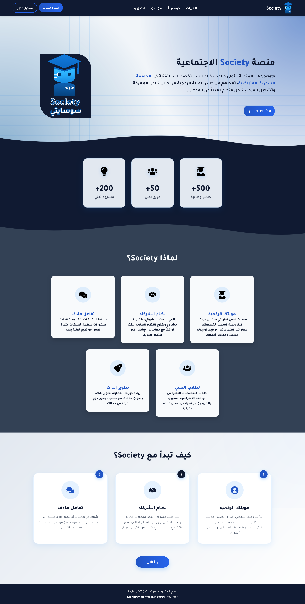 | 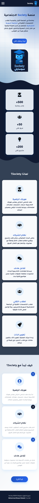 |

### Registration Page

Society is being built as a full ecosystem.
| Desktop | Mobile |
| ------------------------------------------------------------------------ | ---------------------------------------------------------------------- |
| 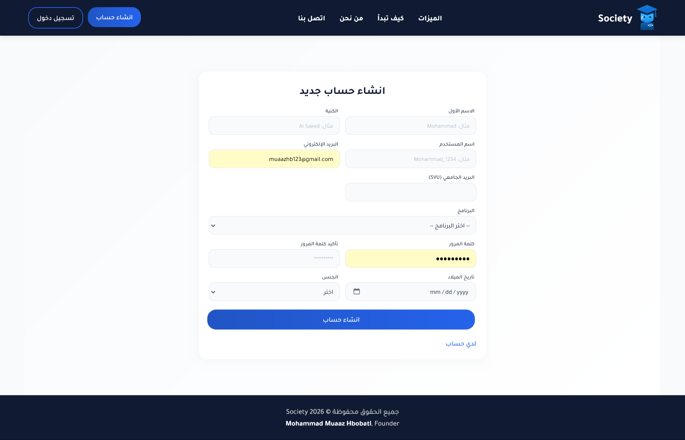 | 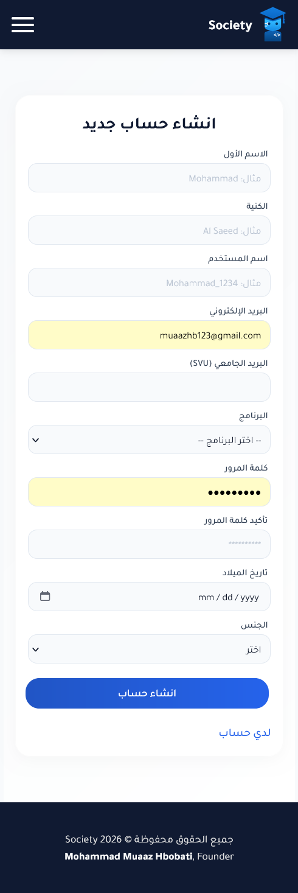 |

### Current Stage

### Home Dashboard

Backend development in progress.
| Desktop | Mobile |
| ---------------------------------------------------------------- | -------------------------------------------------------------- |
| 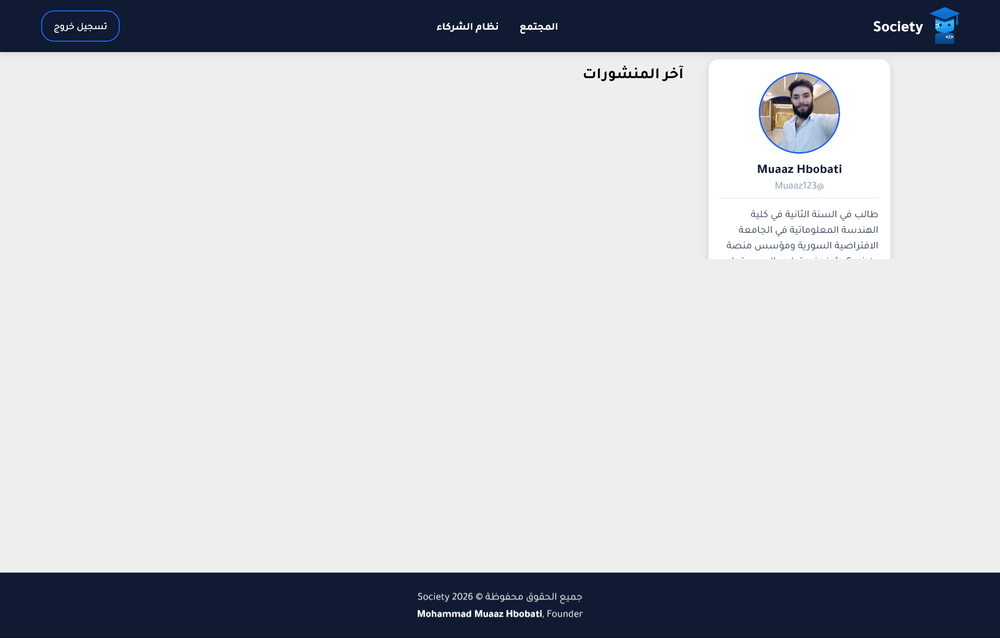 | 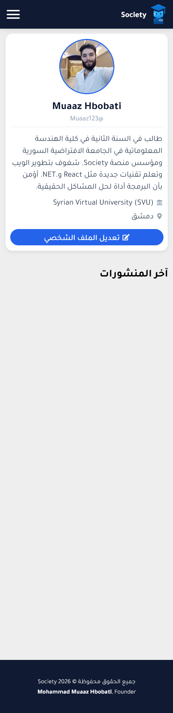 |

Built with:

### Team Formation System

- ASP.NET Core Web API
- Clean Architecture
- Clear domain separation
- JWT authentication
- Business rules independent from infrastructure  
  | Desktop | Mobile |
  | ------------------------------------------------------------------ | --------------------------------------------------------------------- |
  | 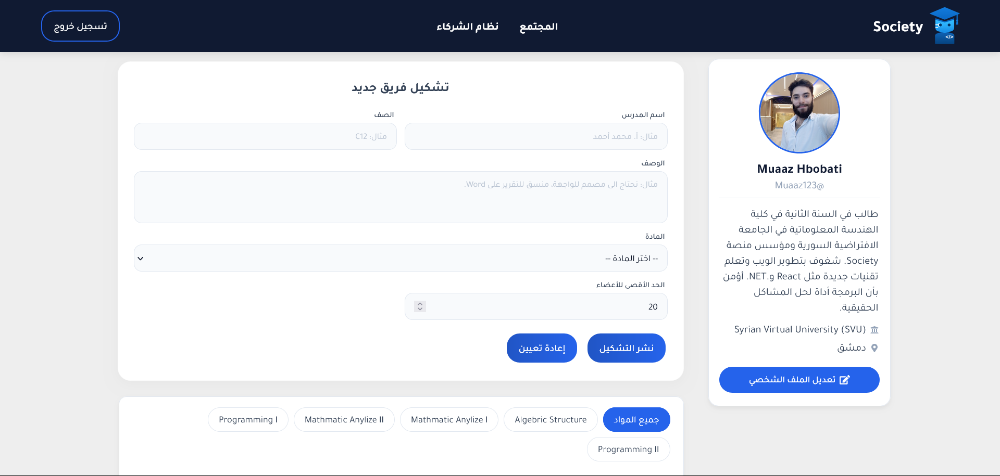 | 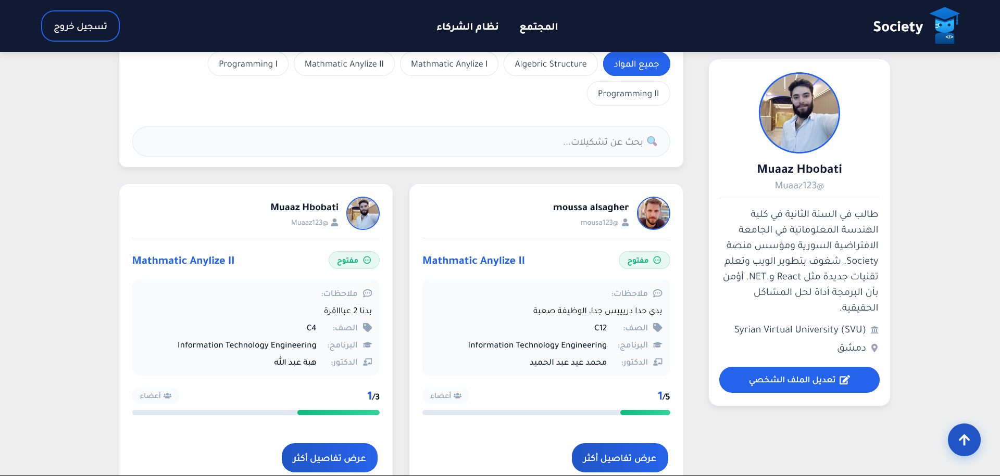 |
  | 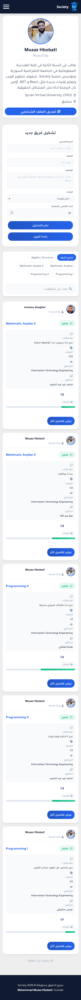 | 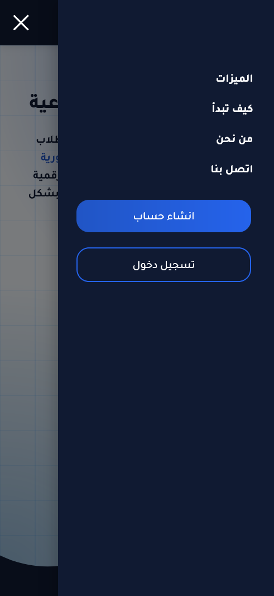 |

The system is designed to scale and evolve without rewriting core logic.

### Team Details

| Desktop                                                                          | Mobile                                                                         |
| -------------------------------------------------------------------------------- | ------------------------------------------------------------------------------ |
| 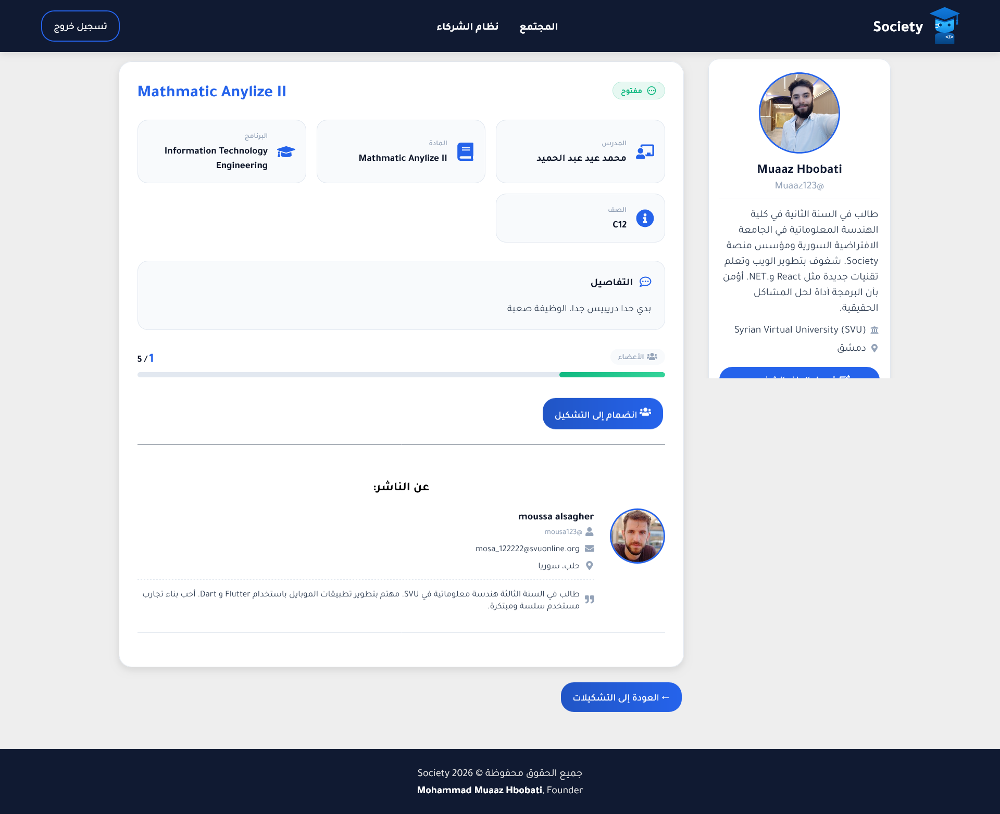 | 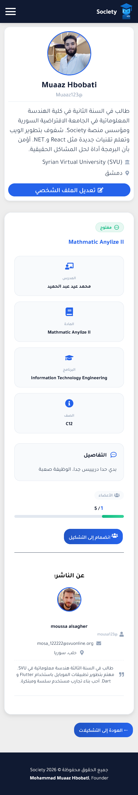 |

---

## Future Direction

## 🚀 Getting Started (Run Locally)

### 1. Clone the repository

```bash
git clone https://github.com/MuaazHbobati/Society.git
cd Society
```

### 2. Backend (API)

- Open `Society.Api/appsettings.json` and update the connection string.
- Run migrations:

```bash
dotnet ef database update --project Society.Infrastructure --startup-project Society.Api
```

Society aims to:

- Run the API:

- Replace fragmented WhatsApp and Telegram chaos with structure
- Offer a real academic community layer
- Expand beyond one university
- Integrate career pathways and student employment systems

```bash
dotnet run --project Society.Api
```

The API will be available at `https://localhost:5001`

### 3. Frontend (React)

```bash
cd Society-SPA
npm install
npm start
```

## The app will open at `http://localhost:3000`

Planned expansions include:

## 🔮 Roadmap

- Frontend applications
- Extended community systems
- Integrated academic tools
- A structured student job market
- Internship and opportunity listings linked to academic profiles
- [x] Clean Architecture setup
- [x] JWT Authentication
- [x] Team Formation system (backend)
- [x] React Landing Page
- [x] Login / Register pages
- [x] Teams listing & details
- [x] Fully responsive design
- [ ] Complete user dashboard
- [ ] Notifications system
- [ ] Deployment to Azure
- [ ] Student job & internship marketplace

---

## Vision

## 📄 License

Not another noisy group.  
Not another copy of social media.
MIT © [Mohammad Muaz Hbobati](https://github.com/MuaazHbobati)

A controlled academic environment.

## 🔗 Links

Society starts with solving chaos.  
It grows into building infrastructure.

- [GitHub Repository](https://github.com/MuaazHbobati/Society)
- [Live Demo (coming soon)](#)
- [My LinkedIn](https://linkedin.com/in/mohammed-mouaz-hbobati)
  0 commit comments
  Comments
  0 (0)

You're not receiving notifications from this thread.
